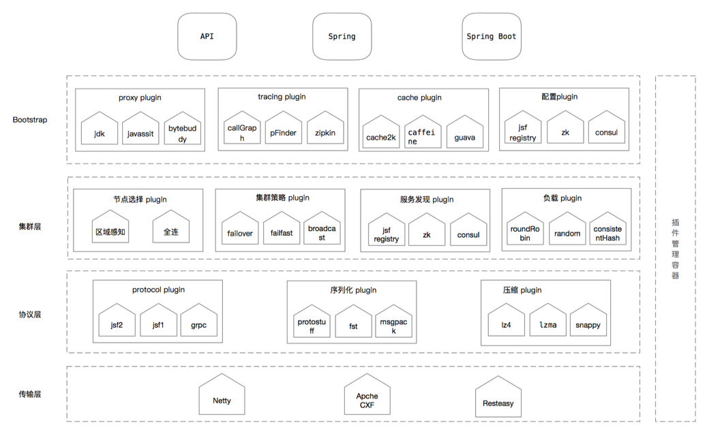

JOYRPC
===

   JOYRPC是一款基于 Java 实现的 RPC 服务框架,是在总结公司内部服务框架经验的基础上，完全从新设计、支持全异步、微内核和插件化。
    

   
## 主要特性
- 全插件化的RPC框架
- 纯异步化，接口完全支持CompletableFuture
- 支持用户自定义插件，实现协议、编解码、序列化、压缩等插件的选用
- 异步化启动
- 支持Zookeeper、ETCD等注册中心，用户可自行扩展

## 快速开始
查看[快速开始](./docs/cn/quickstart.md)。

## 配置参考手册
查看[配置参考手册](./docs/cn/configuration.md)。

## 使用示例
查看[使用示例](./docs/cn/example.md)。

## 常见问题
查看[常见问题](./docs/cn/qa.md)。

## 发布历史
查看[发布历史](./RELEASE.md)。